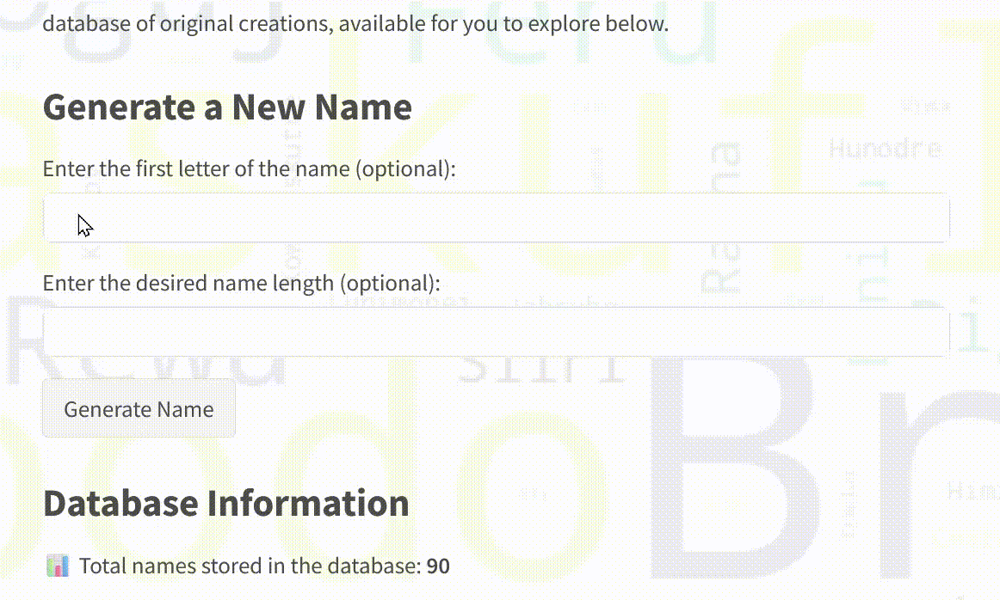

# What's in a Name? - An Anarresti Name Generator

This project is a name generator app inspired by Ursula K. Le Guin's "The Dispossessed," where names on the planet Anarres are assigned by a computer. Online at https://name-gen-ui-581282400880.europe-west1.run.app/.

## Features

* Generates unique names based on simple patterns.
* Uses a Python backend with FastAPI and Uvicorn for efficient API serving.
* Features a Streamlit frontend for a user-friendly experience.
* Data storage using SQLite database stored in a Google Cloud Storage bucket, enabling Cloud Run to access persistent data and allowing for scalability.
* Deployed on Google Cloud Run using Docker for containerization, with separately deployed Dockerfiles for backend and frontend.

## Live Demo

Visit live page at https://name-gen-ui-581282400880.europe-west1.run.app/



## Technologies Used

* **Backend:** Python, FastAPI, Uvicorn
* **Frontend:** Streamlit
* **Database:** SQLite
* **Containerization:** Docker
* **Deployment:** Google Cloud Run
* **Cloud Storage:** Google Cloud Storage

## Getting Started

### Prerequisites

* Python 3.10
* Docker (for containerized deployment)
* Google Cloud SDK (for Cloud Run deployment)

### Local Installation

1.  Clone the repository:

    ```bash
    git clone https://github.com/TimB808/name-generator-public.git
    cd name-generator-public
    ```

2.  Create a virtual environment (recommended):

    ```bash
    python3 -m venv venv
    source venv/bin/activate  # On macOS/Linux
    venv\Scripts\activate  # On Windows
    ```

3.  Install dependencies:

    ```bash
    pip install -r requirements.txt
    ```

4.  Run the backend:

    ```bash
    uvicorn backend:app --host 0.0.0.0 --port 8080
    ```

5.  Run the Streamlit frontend:

    ```bash
    streamlit run app.py
    ```

6.  Open your browser and navigate to `http://localhost:8080` (or the Streamlit port if different).

### Local Database Setup
If running locally, the database is stored in names.db. To override this location, set:

    ```bash
    export DB_PATH=/path/to/names.db  # macOS/Linux  
    set DB_PATH=C:\path\to\names.db  # Windows  
    ```

The Cloud Run deployment automatically fetches the database from Google Cloud Storage.

### Docker Deployment

1.  Build the Docker images:

    ```bash
    docker build -t gcr.io/your-gcp-project-id/name-generator-ui -f Dockerfile.ui .
    docker build -t gcr.io/your-gcp-project-id/name-generator-api -f Dockerfile.api .
    ```

    *Replace `your-gcp-project-id` with your google cloud project id.*

2.  Push the images to Google Container Registry:

    ```bash
    docker push gcr.io/your-gcp-project-id/name-generator-ui
    docker push gcr.io/your-gcp-project-id/name-generator-api
    ```

    *Replace `your-gcp-project-id` with your google cloud project id.*

3.  Deploy to Google Cloud Run:
   *For initial deployment, only run the commands for the backend / api, then use the deployed API URL for deploying the frontend*
    
    ```bash
    gcloud run deploy name-generator-ui --image gcr.io/your-gcp-project-id/name-generator-ui --region your-region --allow-unauthenticated --set-env-vars API_URL=your-api-url
    gcloud run deploy name-generator-api --image gcr.io/your-gcp-project-id/name-generator-api --region your-region --allow-unauthenticated
    ```

    *Replace `your-gcp-project-id` with your google cloud project id and `your-region` with the region you are deploying to; replace your-api-url with the API_URL returned in step 4 below.*

5. After the initial deployment of the api, use the following command to get the deployed API_URL. This then needs to be set in the cloud run deploy command when deploying the frontend Cloud Run service, to ensure it points to the backend Cloud Run service (see step 3).

   ```bash
   gcloud run services describe name-generator-api --format="value(status.url)"
   ```


## Files to highlight

* `app.py`: The Streamlit frontend application.
* `backend.py`: The FastAPI backend API.
* `name_gen.py`: The name generation logic.
* `Dockerfile.ui`: Dockerfile for the Streamlit frontend.
* `Dockerfile.api`: Dockerfile for the FastAPI backend.
* `requirements.txt`: Python dependencies.

## Contributing

Feel free to contribute by submitting pull requests or opening issues.
